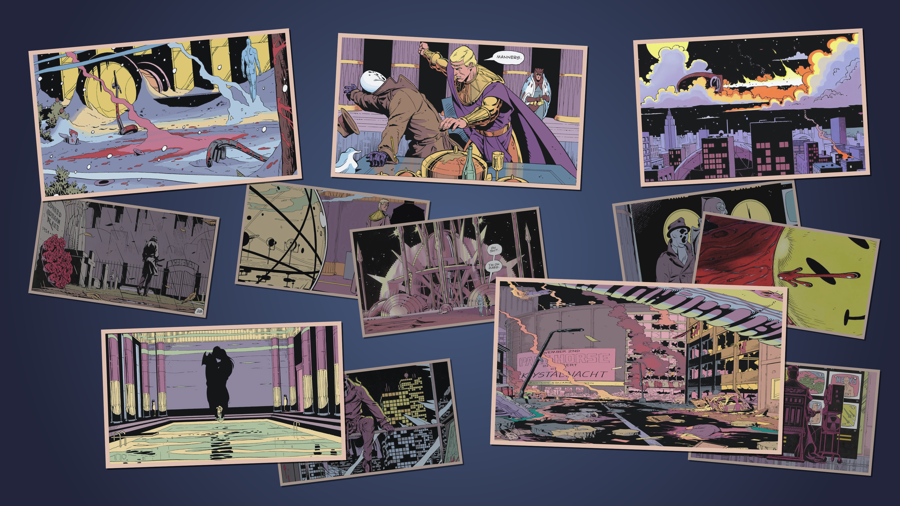
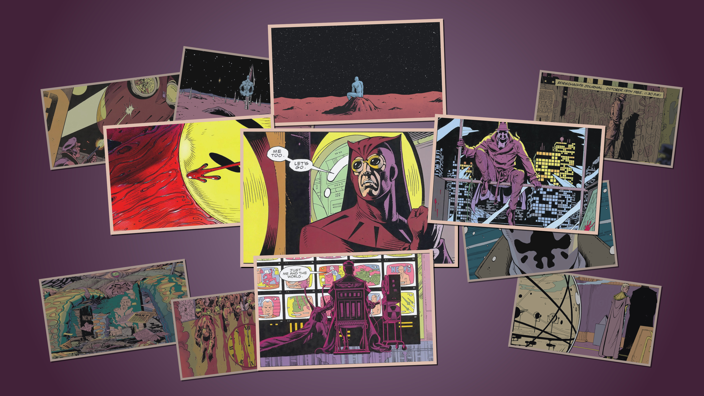
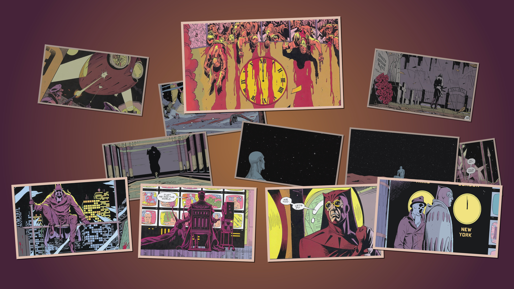
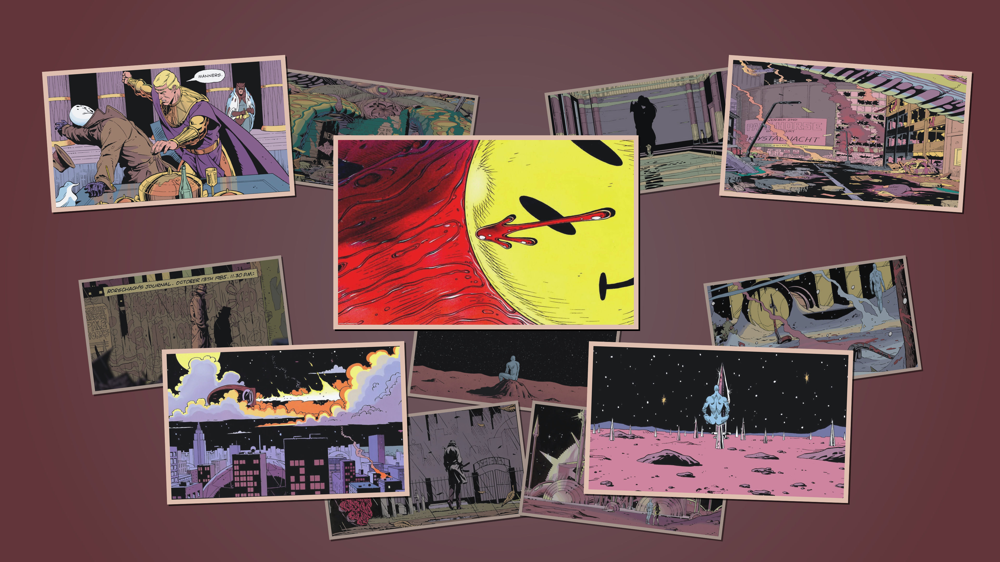

# Watchmen Omarchy Theme

An Omarchy theme built from ink-dark panels, paper-warm text, cold blue focus, and a restrained graphic-novel palette. It ships as a normal Omarchy theme directory: colors, shell styling, app overrides, and finished wallpapers are all kept at the repo root where Omarchy expects them.

## Preview


## Install

```bash
omarchy-theme-install https://github.com/OldJobobo/omarchy-watchmen-theme
```

Then select `watchmen` from the Omarchy theme picker, or run:

```bash
omarchy-theme-set watchmen
```

## What's Included

- Omarchy theme colors in `colors.css` and `colors.toml`
- Hyprland, Hyprlock, Waybar, Walker, Mako, SwayOSD, and GTK styling
- Terminal themes for Foot, Ghostty, Kitty, Alacritty, and Warp
- App themes for btop, Chromium, Vencord, Zed, Neovim, and cliamp
- A 17-wallpaper set in `backgrounds/`
- Palette references in `palette/`

## Wallpapers

All shipped wallpapers are 4K except `show-4-rorschach-radial.jpg`, which is 3440x1440.

<table>
  <tr>
    <td></td>
    <td></td>
    <td></td>
  </tr>
  <tr>
    <td></td>
    <td></td>
    <td></td>
  </tr>
</table>

## Notes

This repository is intended to be the release theme only. Wallpaper-generation scripts, scene YAMLs, source images, probe renders, and other build-workspace files belong in the separate generator project, not in the published theme.

Keep final wallpapers in `backgrounds/`. Keep temporary renders in `/tmp` or another ignored workspace.
